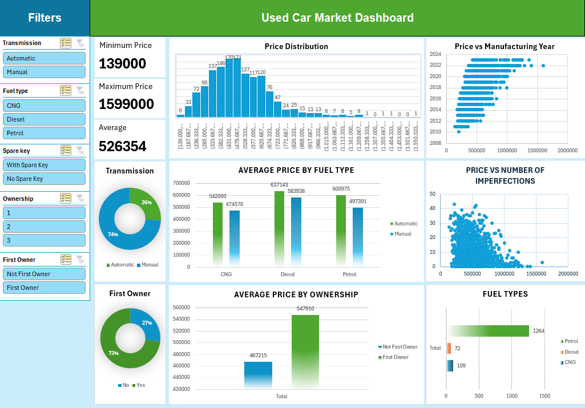

# Used Car Market Dashboard and Analysis

This repository contains an `.xlsx` file with data and a dashboard for analyzing the used car market.

## Dashboard Preview

## Features

- Car Model & Manufacturing Year  
- Price & Mileage (KM Driven)  
- Engine Capacity & Fuel Type  
- Transmission Type (Manual/Automatic)  
- Ownership History  
- First Owner (Yes/No) – **Personal Addition**  
- Spare Key Availability  
- Vehicle Condition (Imperfections & Repainted Parts)

## Dashboard

The dashboard provides visual insights for market trend analysis and decision-making.

## Data Source

The dataset used in this analysis is sourced from Kaggle:  
[Used Car Price Data from Cars24](https://www.kaggle.com/datasets/amanrajput16/used-car-price-data-from-cars24)
